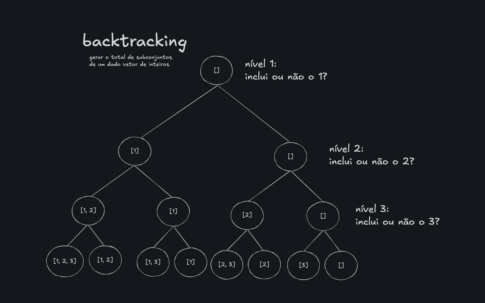

# backtracking
backtracking, quando falamos de recursão, é uma técnica de exploração de soluções que consiste em testar possibilidades de forma recursiva e volta (backtrack) quando percebe-se que aquele caminho não leva à solução
* é literalmente tentar e errar com elegância

## funcionamento (em termos simples)
1. explora uma decisão (ex: colocar um número em um tabuleiro, escolher um item, visitar um nó)
2. chama a função recursivamente para continuar a partir daquela escolha
3. se chegar a um ponto inválido ou sem solução
    * desfaz a escolha anterior (backtrack)
    * testa outra possibilidade

## ex clássico: problema das N rainhas
a ideia é tentar colocar rainhas em um tabuleiro de xadrez de forma que nenhum ataque a outra
    * tenta colocar a primeira rainha na primeira linha
    * recursivamente tenta colocar a próxima rainha na próxima linha
    * se descobrir que a escolha anterior levou a um beco sem saída, volta e tenta outra coluna na linha anterior

## diferença de recursões
| recursão simples               | recursão com backtracking             |
| ------------------------------ | ------------------------------------- |
| resolve um problema em etapas  | explora **vários caminhos** possíveis |
| não desfaz decisões anteriores | **desfaz** decisões quando necessário |
| Ex: fatorial, fibonacci        | ex: sudoku, N rainhas, labirinto      |

```c
bool resolver(int passo) {
    if (chegou_no_fim_com_sucesso()) return true;

    for (cada_opcao_possivel) {
        if (opcao_valida) {
            fazer_escolha;
            if (resolver(passo + 1)) return true;
            desfazer_escolha; // backtrack
        }
    }

    return false;
}
```

## onde backtracking brilha
* resolver problemas combinatórios
* sudoku
* caixeiro-viajante
* subconjuntos e permutações
* labirintos
* problemas de partição

## problemas clássicos usando backtracking

### 1. gerar todos os subconjuntos
dado um vetor de números inteiros de tamanho n, queremos gerar todos os subconjuntos possíveis (também chamado de power set)

```
{1, 2, 3}
--

{}
{1}
{1, 2}
{1, 2, 3}
{2}
{2, 3}
{3}
```

vamos seguir um raciocínio recursivo com backtraking, ou seja:
> para cada elemento, decidiremos:
> * vou incluir esse número no subconjunto atual?
> * ou vou ignorar ele

esse tipo de decisão binária (sim ou não) forma uma árvore binária de possibilidades. no final, quando você já tomou a dicisão para todos os elementos, você imprime o subconjunto que foi formado

*árvore de chamadas*: cada nível representa uma escolha

* no nível 3, chegamos ao fim - imprima o subconjunto atual

*obs*: subarrays são diferentes de subconjuntos!
* em um *subconjunto* a ordem não importa, não precisa ser contíguo
* em um *subarray* a ordem importa, já que um subvetor contíguo

* para um `conjunto` de `n`elementos:
**total de subconjuntos =  2ⁿ** (inclui o conjunto vazio)
ex): n = 3
subconjuntos = 2³ = 8
subconjuntos: {}, {1}, {2}, {3}, {1,2}, {1,3}, {2,3}, {1,2,3}

cada elemento tem 2 escolhas: entrar ou não entrar no subconjunto (princípior fundamental da contagem)
com `n` elementos: `2 × 2 × ... × 2 = 2ⁿ`

* para um `array` de `n` elementos:
**total de subarrays = n(n+1)/2**
ex) n = 3
subarrays: {1}, {2}, {3}, {1,2}, {2,3}, {1,2,3}
total = 3(3 + 1)/2 = 6

para um subarray, escolhemos:
* uma posição inicial `i` (de 0 a n-1)
* uma posição final `j >= i`
* como os subarrays são contíguos, o total vira uma soma


**implementação**
```c
void gerarSubconjuntos(int *nums, int n, int idx, int *subset, int tam);
```
* `nums[]` é o vetor original 
* `n` é o tamanho de `nums`
* `idx` é a posição atual que estamos decidindo
* `subset[]` é o vetor temporário onde armazenamos o subconjunto atual
* `tam` é o tamanho atual do subconjunto sendo formado

*na chamada inicial*
```c
#include <math.h>

int nums[] = {1, 2, 3};
int n = sizeof(nums) / sizeof(nums[0]);

int lenSubset = pow(2, n);
int subset[lenSubset];

gerarSubconjuntos(nums, n, 0, subset, 0);
```

*etapas da recusão*

quando `idx == n`
> já tomamos decisão para todos os elementos
> imprimirmos o subconjunto gerado pelo produto dessas decisões

para cada elemento, temos duas escolhas:
1. ignorar o elemento atual:
```c
gerarSubconjuntos(nums, n, idx + 1, subset, tam);
```

2. incluir o elemento atual
```c
subset[tam] = nums[idx];
gerarSubconjuntos(nums, n, idx + 1, subset, tam + 1);
```

trace
```
idx = 0 → 1?
 ├── não inclui → idx = 1 → 2?
 │     ├── não inclui → idx = 2 → 3?
 │     │     ├── não inclui → []
 │     │     └── inclui     → [3]
 │     └── inclui     → [2]
 │           ├── não inclui → [2]
 │           └── inclui     → [2,3]
 └── inclui     → [1]
       ├── não inclui → idx = 1 → 2?
       │     ├── não inclui → [1]
       │     └── inclui     → [1,3]
       └── inclui     → [1,2]
             ├── não inclui → [1,2]
             └── inclui     → [1,2,3]
```

código completo
```c
void imprimir(int *subset, int tam) {
    printf("{");
    for (int i = 0; i < tam; i++) {
        printf("%d ", subset[i]);
        if (i < tam - 1) printf(", ");
    }
    printf("}\n")
}

void gerarSubconjuntos(int *nums, int n, int idx, int *subset, int tam) {
    if (idx == n) { // atingiu-se o total de decisões para aquele elemento
        imprimir(subset, tam);
        return;
    }
    // inclui o número???

    // dicidiu não incluir
    gerarSubconjuntos(nums, n, idx + 1, subset, tam);

    // dicidiu incluir
    subset[tam] = nums[idx];
    gerarSubconjuntos(nums, n, idx + 1, subset, tam + 1);
}
```